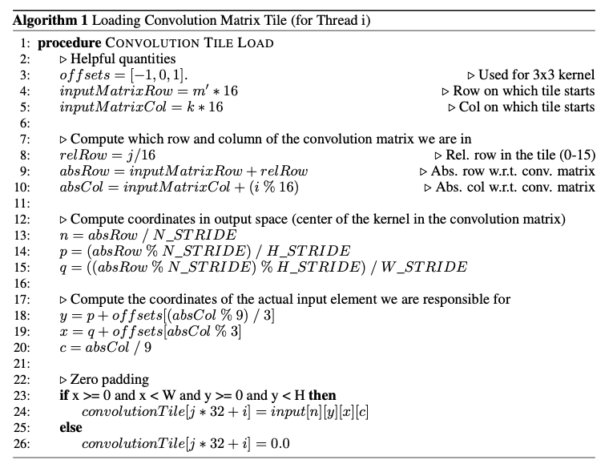
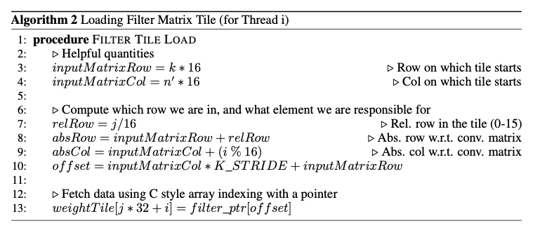

# Implicitt GEMM Tensor Core Convolution

Simple example of how to write an Implicit GEMM Convolution in CUDA using the Tensor Core WMMA API and bindings for PyTorch.

## How to use
Note: this assumes Python 3.8, Ubuntu 18.04, and CUDA 11.6

You might need to `sudo apt install libpython3.7-dev` and `apt-get install ninja-build` (for JIT)

<!-- For python 3.10 in env/lib/python3.10/site-packages/torch/utils/cpp_extension.py, change `import importlib` to `import importlib.abc` -->

- Create a virtual environment: `python3 -m venv env`
- Activate the virtual environment: `source env/bin/activate`
- Install requirements:
    - `pip install -U pip`
    - `pip install wheel`
    - `pip install -r requirements.txt`
- Navigate into the `pytorch-extension` directory and run the test script:
    - `python test.py --acc` or `python test.py --perf`

## Src
Under `pytorch-extension/src` there's a variety of files.
- `conv.cpp` - entrypoint for bindings
- `conv_3x3_same_padding.cu` - direct convolution implementation
- `conv_3x3_same_padding_tc_vX.cu` - various implementations of a implicit GEMM tensor core convolution
- `conv_3x3_same_padding_tc_upper_bound.cu` - gutted convolution implementation to test perf upper bound

## Algorithm Sketch
For this discussion, let the convolution matrix have dimensions M × K, the filter matrix have dimensions K × N and the output matrix have dimensions M × N and let M, N, and K be divisible by 16.

Since the WMMA matrix provides warp-granularity access to Tensor Cores, it’s natural to think about the implementation of the implicit GEMM algorithm in terms of warps. In my implementation, each warp does the following:
1. Define 3 Fragments A, B, and C, where A is used to hold the convolution matrix tile, B is used to hold the filter matrix tile, and C acts as an accumulator tile for the reduction over the K dimension (C should be zeroed out at the beginning).
2. Form and load a 16 × 16 tile of the convolution matrix from global memory to a dedicated, warp-specific 16 × 16 tile of shared memory.
3. Form and load a 16 × 16 tile of the filter matrix from global memory to a dedicated, warp-specific 16 × 16 tile of shared memory.
4. Load the tiles from shared memory into their respective fragments A and B.
5. ComputetheMMAoperation:C=A∗B+C
6. Repeat steps 2-5 for K/16 iterations to perform the full reduction over the K dimension.
7. Store the 16 × 16 tile of output in Fragment C to global memory.

Since the basic chunk of work in a CUDA program is a thread block, not a warp, and because shared memory is assigned per thread block, we can take this warp-granularity algorithm and convert it into a thread block-granularity one by conceptually decomposing a thread block into a grid of warps. More specifically, in my implementation, each thread block consists of a (128, 2) grid of threads, which can also be viewed as a (4, 2) grid of warps. Each thread block is assigned enough shared memory so that each warp has two 16 × 16 tiles worth of scratchpad memory it can use to form and store the convolution and weight matrix tiles it needs for the computation. Since a (4, 2) grid of warps will compute a 64 × 32 matrix of output, all that’s left to do is launch enough thread blocks to cover the entire output matrix.

The proposed algorithm has some desirable qualities in that it’s a relatively easy to understand problem decomposition and there’s basically no synchronization required since warps within a thread block never need to synchronize with each other. Additionally, the idea of having a small, fixed amount of per-warp shared memory for tiles arose from this strategy for decomposing the problem, and it allowed me to attain pretty good warp occupancy since it limits the amount of shared memory needed per thread block, independent of problem size.

## Forming and Loading the Tiles into Shared Memory
From an algorithmic perspective, forming and loading the convolution matrix tiles into shared memory was probably the trickiest part of the implementation. For both the convolution matrix and filter matrix tiles, the strategy I used was to have each thread in the 32-thread warp load 8 elements for each tile from global memory into shared memory. More specifically, if we think of how to distribute work for loading a 16 × 16 tile of memory to 32 threads, the natural algorithm that arises is to have the first 16 threads load the first row of 16 elements, have the second 16 threads load the second row of 16 elements, and then repeat this process 8 times in a loop to load the full tile. The only additional work that needs to be done is for each thread to figure out what data from the input tensors it should load.

To setup this problem, suppose we launch a grid of (M′,N′) warps to compute the full implicit GEMM convolution. Each warp will be associated with an (m′, n′) index into the grid, which will give us information about where in the input and filter weight tensors we should be looking. Now additionally suppose we are looking at thread i (where i ∈ [0, 31)) in the warp which is on iteration k of the reduction over the inner dimension of the matrix (this is the "dot product" like reduction over tiles for the MMA) and iteration j (where j ∈ [0, 8)) of loading the tile into shared memory. I will also use the quantities N_STRIDE = H ∗ W,H_STRIDE = W,W_STRIDE = 1 to refer to the stride between elements in the convolution matrix, and ROW_SIZE = R ∗ S ∗ C to refer to the number of elements in a row of the convolution matrix.

Then for the convolution tile, for a 3x3 convolution with stride 1 and width 1 zero-padding, we can determine the value to load into the j ∗ 32 + i position of the tile (when viewed as a linear array in memory) as shown in Algorithm 1.

Loading the filter tile can be done similarly, but is much simpler. Let K_STRIDE = R ∗ S ∗ C be the stride in the K dimension of the filter weight tensor and filter_ptr be a pointer to the first element of the filter weights in memory. The algorithm is shown in Algorithm 2.

## TODO
- Add instructions for compiling as a separate module
- Improve performance (explore reuse, more efficient memory access pattern, async memory loads, etc)